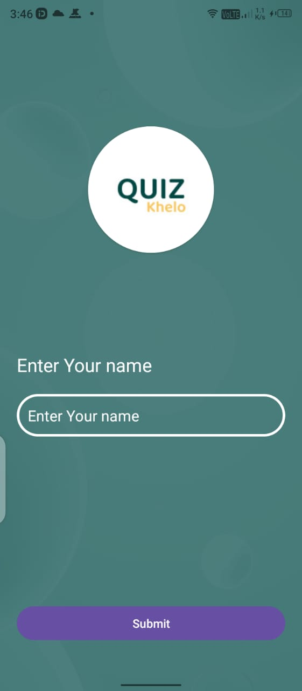
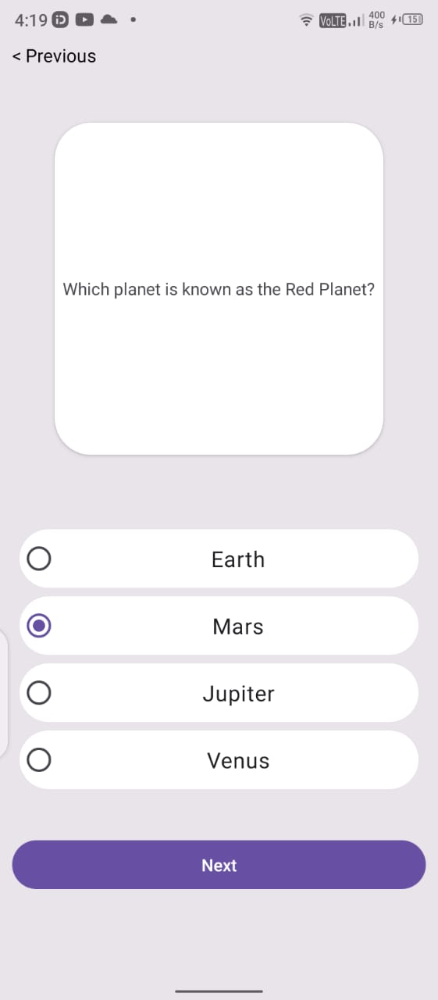
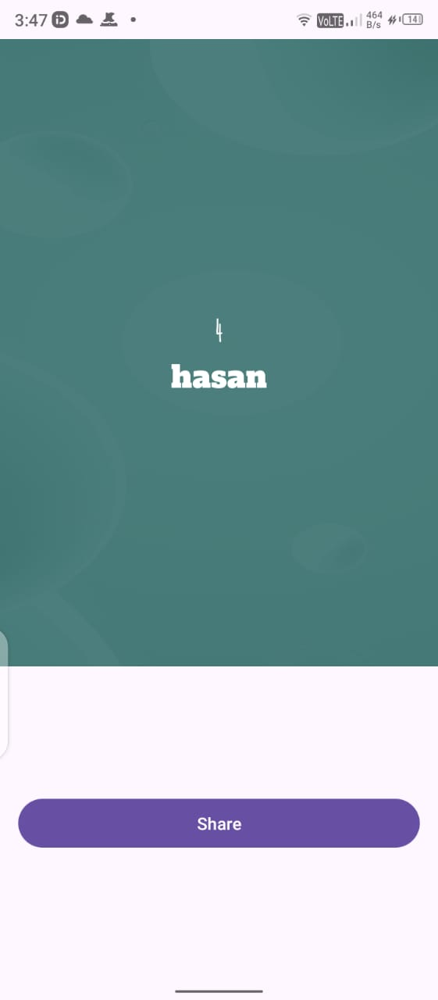

# 📱 Android Quiz App

An interactive **Quiz App** built with Android Studio that lets users answer questions, track scores, and share results.


## 🎯 Features
- ✅ Multiple-choice questions with a radio button interface.
- 📊 Score tracking and result display.
- ⏩ Next & Previous buttons for easy navigation.
- 📤 Share your score on social media.
- 🎨 Custom UI with wave animation.

---
## 📸 Screenshots

### **🏠 Home Screen**


### **📝 Quiz Screen**


### **📤 Share Feature**


---
## 🚀 Installation
1. **Clone the Repository:**
   ```sh
   git clone https://github.com/yourusername/AndroidQuizApp.git
   ```
2. **Open in Android Studio** and build the project.
3. **Run** on an emulator or device.

---
## 📤 Social Media Sharing
```java
Intent shareIntent = new Intent(Intent.ACTION_SEND);
shareIntent.setType("text/plain");
shareIntent.putExtra(Intent.EXTRA_TEXT, ""Share Your awsome score which is " + score);
startActivity(Intent.createChooser(shareIntent, "Share via"));
```

---
## ⭐ Show Some Love
If you like this project, **give it a star ⭐ on GitHub**!

